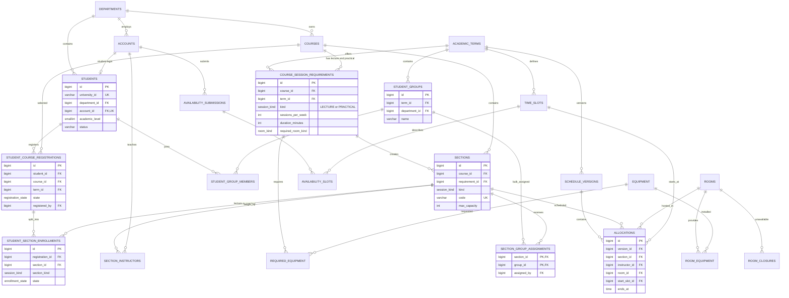

# Tanseek v2 — Unified ERD

## Meaning of the similarly named entities

- `student_groups`: organisational cohorts such as `AI-L3-A`. They help the coordinator assign many students together.
- `sections`: actual teaching streams for one course component, such as `AI301-L1` or `AI301-P2`.
- `section_group_assignments`: a bulk/default mapping from a cohort to a section. The backend expands it into individual enrollments.
- `student_section_enrollments`: the authoritative personal assignment. Every registered student gets one active Lecture section and one active Practical section per course.

The student's timetable is built from `student_section_enrollments -> sections -> allocations`, not from the student's academic level.

Student authentication uses an `ACCOUNTS` row with role `STUDENT`, linked 1:1 through `STUDENTS.account_id`. This role is read-only and can only view its own profile, registrations, section enrollments, and published timetable.
